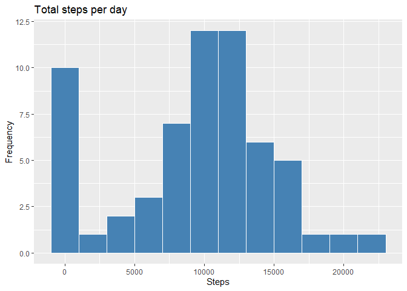
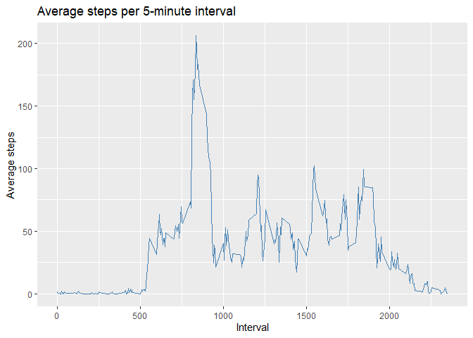
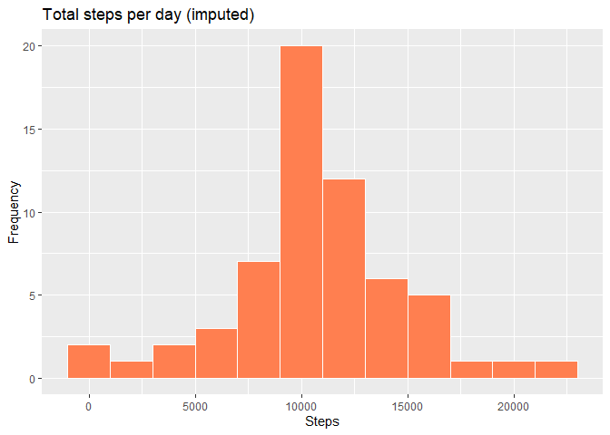
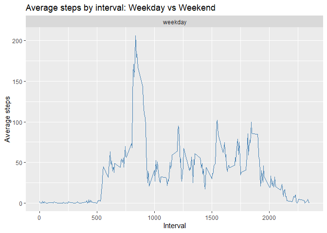

## Loading and preprocessing the data


``` r
library(ggplot2)
library(dplyr)

unzip("activity.zip")
activity <- read.csv("activity.csv")
activity$date <- as.Date(activity$date)
```

---

## What is mean total number of steps taken per day?


``` r
steps_day <- activity %>%
  group_by(date) %>%
  summarise(total_steps = sum(steps, na.rm = TRUE))

ggplot(steps_day, aes(x = total_steps)) +
  geom_histogram(binwidth = 2000, fill = "steelblue", color = "white") +
  labs(title = "Total steps per day",
       x = "Steps", y = "Frequency")
```

<!-- -->

``` r
mean_steps   <- mean(steps_day$total_steps)
median_steps <- median(steps_day$total_steps)
```

- **Mean:** 9354.23 steps  
- **Median:** 1.0395\times 10^{4} steps

---

## What is the average daily activity pattern?


``` r
interval_avg <- activity %>%
  group_by(interval) %>%
  summarise(avg_steps = mean(steps, na.rm = TRUE))

ggplot(interval_avg, aes(x = interval, y = avg_steps)) +
  geom_line(color = "steelblue") +
  labs(title = "Average steps per 5-minute interval",
       x = "Interval", y = "Average steps")
```

<!-- -->

``` r
max_interval <- interval_avg$interval[which.max(interval_avg$avg_steps)]
```

The 5-minute interval with the maximum average steps is: **835**

---

## Imputing missing values


``` r
total_na <- sum(is.na(activity$steps))
```

Total missing values: **2304**

Strategy: replace each NA with the **mean of its 5-minute interval**.


``` r
activity_imputed <- activity %>%
  left_join(interval_avg, by = "interval") %>%
  mutate(steps = ifelse(is.na(steps), avg_steps, steps)) %>%
  select(-avg_steps)

steps_day2 <- activity_imputed %>%
  group_by(date) %>%
  summarise(total_steps = sum(steps))

ggplot(steps_day2, aes(x = total_steps)) +
  geom_histogram(binwidth = 2000, fill = "coral", color = "white") +
  labs(title = "Total steps per day (imputed)",
       x = "Steps", y = "Frequency")
```

<!-- -->

``` r
mean_steps2   <- mean(steps_day2$total_steps)
median_steps2 <- median(steps_day2$total_steps)
```

- **Mean (imputed):** 1.076619\times 10^{4}  
- **Median (imputed):** 1.076619\times 10^{4}

---

## Are there differences in activity patterns between weekdays and weekends?


``` r
activity_imputed <- activity_imputed %>%
  mutate(day_type = ifelse(weekdays(date) %in% c("Saturday", "Sunday"),
                           "weekend", "weekday"),
         day_type = factor(day_type))

interval_daytype <- activity_imputed %>%
  group_by(interval, day_type) %>%
  summarise(avg_steps = mean(steps))

ggplot(interval_daytype, aes(x = interval, y = avg_steps)) +
  geom_line(color = "steelblue") +
  facet_wrap(~ day_type, nrow = 2) +
  labs(title = "Average steps by interval: Weekday vs Weekend",
       x = "Interval", y = "Average steps")
```

<!-- -->
